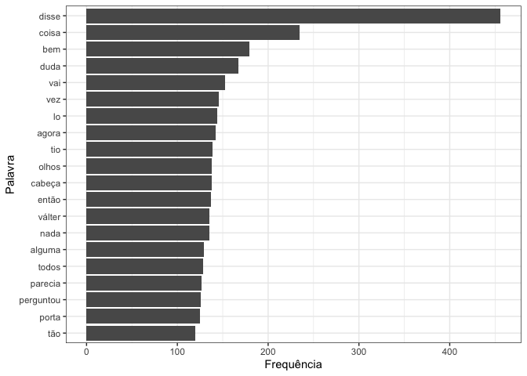
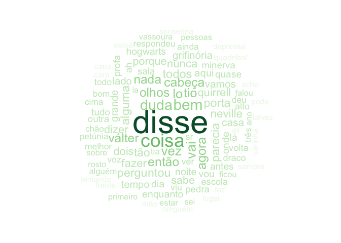

Word frequencies
================
Andrew
02/10/2022

# Frequency of words in a book

## Data prep

### Load the text file and tokenise words:

I’m using a book that I want to read in my target language. Any `.txt`
file will work (and you can convert ebooks to `.txt` with calibre).

    ##     doc_id              text          
    ##  Length:1           Length:1          
    ##  Class :character   Class :character  
    ##  Mode  :character   Mode  :character

### Add portuguese stop words:

### Add character names as stop words (more to add):

## Visualisations

Top 20 words and their frequency:
<!-- -->

### Generate a word cloud with the top 100 words:

<!-- -->

### Top 1000 words:

Full list:

TODO: Add a translation col

| Word           | Frequency |
|:---------------|----------:|
| disse          |       456 |
| coisa          |       235 |
| bem            |       179 |
| duda           |       167 |
| vai            |       153 |
| vez            |       146 |
| lo             |       144 |
| agora          |       142 |
| tio            |       139 |
| cabeça         |       138 |
| olhos          |       138 |
| então          |       137 |
| nada           |       135 |
| válter         |       135 |
| alguma         |       129 |
| todos          |       128 |
| parecia        |       127 |
| perguntou      |       126 |
| porta          |       125 |
| tão            |       120 |
| fazer          |       118 |
| neville        |       118 |
| dizer          |       114 |
| nunca          |       114 |
| quirrell       |       113 |
| dois           |       112 |
| porque         |       110 |
| sabe           |       109 |
| casa           |       105 |
| vamos          |       105 |
| grifinória     |       102 |
| aqui           |       101 |
| grande         |       101 |
| lado           |       100 |
| tempo          |        98 |
| noite          |        96 |
| enquanto       |        94 |
| onde           |        93 |
| dia            |        92 |
| hogwarts       |        92 |
| vou            |        92 |
| lá             |        91 |
| antes          |        90 |
| quase          |        90 |
| tudo           |        89 |
| ah             |        87 |
| minerva        |        86 |
| pedra          |        86 |
| sala           |        86 |
| outra          |        85 |
| profa          |        85 |
| draco          |        83 |
| sr             |        83 |
| escola         |        82 |
| ver            |        82 |
| volta          |        82 |
| alto           |        80 |
| deu            |        80 |
| ainda          |        78 |
| respondeu      |        78 |
| todo           |        78 |
| viu            |        78 |
| voz            |        78 |
| melhor         |        77 |
| tia            |        77 |
| bom            |        75 |
| cima           |        75 |
| petúnia        |        74 |
| chão           |        73 |
| três           |        73 |
| alguém         |        71 |
| estar          |        69 |
| pessoas        |        69 |
| ficou          |        68 |
| sobre          |        68 |
| vassoura       |        68 |
| falou          |        67 |
| primeiro       |        67 |
| rosto          |        67 |
| sei            |        67 |
| ano            |        66 |
| ia             |        66 |
| mão            |        65 |
| quadribol      |        65 |
| varinha        |        65 |
| cara           |        63 |
| frente         |        63 |
| lugar          |        63 |
| ninguém        |        63 |
| fez            |        62 |
| sempre         |        62 |
| talvez         |        62 |
| acho           |        61 |
| ali            |        61 |
| depressa       |        61 |
| pode           |        61 |
| sabia          |        61 |
| capa           |        60 |
| sonserina      |        60 |
| tentando       |        60 |
| alunos         |        59 |
| dentro         |        59 |
| hora           |        58 |
| prof           |        58 |
| mesa           |        57 |
| weasley        |        56 |
| espelho        |        55 |
| ficar          |        55 |
| filch          |        55 |
| poderia        |        55 |
| podia          |        55 |
| cada           |        54 |
| gente          |        54 |
| virou          |        54 |
| meio           |        53 |
| mundo          |        53 |
| repente        |        53 |
| saber          |        53 |
| senhor         |        53 |
| ar             |        52 |
| menino         |        52 |
| outro          |        52 |
| outros         |        52 |
| rúbeo          |        52 |
| claro          |        51 |
| falar          |        51 |
| saiu           |        51 |
| seguinte       |        51 |
| aí             |        50 |
| primeira       |        50 |
| quanto         |        50 |
| coisas         |        49 |
| direção        |        49 |
| la             |        49 |
| menos          |        49 |
| pouco          |        49 |
| carta          |        48 |
| começou        |        48 |
| duas           |        48 |
| madame         |        48 |
| nome           |        48 |
| olhar          |        48 |
| quero          |        48 |
| assim          |        47 |
| certeza        |        47 |
| finalmente     |        47 |
| malfoy         |        47 |
| pontos         |        47 |
| realmente      |        47 |
| toda           |        47 |
| livros         |        46 |
| mãe            |        46 |
| olhou          |        46 |
| pai            |        46 |
| qualquer       |        46 |
| dar            |        45 |
| devia          |        45 |
| fazendo        |        45 |
| olívio         |        45 |
| passar         |        45 |
| vezes          |        45 |
| bruxo          |        44 |
| embora         |        44 |
| trás           |        44 |
| verdade        |        44 |
| voldemort      |        44 |
| caminho        |        43 |
| corredor       |        43 |
| gritou         |        43 |
| ouviu          |        43 |
| rua            |        43 |
| vida           |        43 |
| coruja         |        42 |
| dragão         |        42 |
| sido           |        42 |
| tentou         |        42 |
| trasgo         |        42 |
| vão            |        42 |
| atrás          |        41 |
| bruxos         |        41 |
| chapéu         |        41 |
| correndo       |        41 |
| cabelos        |        40 |
| hoje           |        40 |
| boca           |        39 |
| floresta       |        39 |
| passou         |        39 |
| percy          |        39 |
| lufa           |        38 |
| mãos           |        38 |
| meia           |        38 |
| pessoa         |        38 |
| quer           |        38 |
| anos           |        37 |
| conseguiu      |        37 |
| encontrar      |        37 |
| instante       |        37 |
| ir             |        37 |
| los            |        37 |
| manhã          |        37 |
| professor      |        37 |
| sair           |        37 |
| sra            |        37 |
| capítulo       |        36 |
| deixou         |        36 |
| exclamou       |        36 |
| família        |        36 |
| garoto         |        36 |
| boa            |        35 |
| cama           |        35 |
| cinco          |        35 |
| magia          |        35 |
| olhando        |        35 |
| quatro         |        35 |
| quê            |        35 |
| queria         |        35 |
| time           |        35 |
| abriu          |        34 |
| aula           |        34 |
| demais         |        34 |
| fred           |        34 |
| logo           |        34 |
| posso          |        34 |
| segundo        |        34 |
| trem           |        34 |
| alguns         |        33 |
| apenas         |        33 |
| cachorro       |        33 |
| caiu           |        33 |
| contra         |        33 |
| dez            |        33 |
| mal            |        33 |
| pensar         |        33 |
| pirraça        |        33 |
| razão          |        33 |
| tarde          |        33 |
| trouxas        |        33 |
| uns            |        33 |
| andar          |        32 |
| deve           |        32 |
| entrar         |        32 |
| jorge          |        32 |
| minutos        |        32 |
| pés            |        32 |
| seguida        |        32 |
| sentiu         |        32 |
| sim            |        32 |
| algum          |        31 |
| bateu          |        31 |
| fazia          |        31 |
| jogo           |        31 |
| nariz          |        31 |
| parede         |        31 |
| parou          |        31 |
| quarto         |        31 |
| acha           |        30 |
| diante         |        30 |
| fofo           |        30 |
| mulher         |        30 |
| nenhum         |        30 |
| voltar         |        30 |
| aulas          |        29 |
| durante        |        29 |
| fogo           |        29 |
| olhe           |        29 |
| ouvir          |        29 |
| ouviram        |        29 |
| salão          |        29 |
| tanto          |        29 |
| achou          |        28 |
| alta           |        28 |
| cartas         |        28 |
| continuava     |        28 |
| difícil        |        28 |
| flamel         |        28 |
| levantou       |        28 |
| livro          |        28 |
| murmurou       |        28 |
| novo           |        28 |
| parte          |        28 |
| pé             |        28 |
| perto          |        28 |
| sapo           |        28 |
| sorte          |        28 |
| carro          |        27 |
| conseguia      |        27 |
| contar         |        27 |
| desde          |        27 |
| esperando      |        27 |
| favor          |        27 |
| gringotes      |        27 |
| horas          |        27 |
| janela         |        27 |
| norberto       |        27 |
| professora     |        27 |
| todas          |        27 |
| velho          |        27 |
| vira           |        27 |
| biblioteca     |        26 |
| casas          |        26 |
| cor            |        26 |
| deixar         |        26 |
| dizendo        |        26 |
| entrou         |        26 |
| guarda         |        26 |
| lembrar        |        26 |
| maior          |        26 |
| mesma          |        26 |
| pais           |        26 |
| poder          |        26 |
| puxou          |        26 |
| sangue         |        26 |
| tirou          |        26 |
| verde          |        26 |
| vestes         |        26 |
| aconteceu      |        25 |
| caso           |        25 |
| castelo        |        25 |
| chegar         |        25 |
| comprar        |        25 |
| contou         |        25 |
| corujas        |        25 |
| fim            |        25 |
| gêmeos         |        25 |
| levou          |        25 |
| medo           |        25 |
| mim            |        25 |
| naquele        |        25 |
| natal          |        25 |
| pensou         |        25 |
| pudesse        |        25 |
| semana         |        25 |
| sentou         |        25 |
| vassouras      |        25 |
| apanhou        |        24 |
| armário        |        24 |
| baixo          |        24 |
| cair           |        24 |
| força          |        24 |
| gato           |        24 |
| granger        |        24 |
| ideia          |        24 |
| muita          |        24 |
| pareceu        |        24 |
| pareciam       |        24 |
| preciso        |        24 |
| procurando     |        24 |
| teto           |        24 |
| voltou         |        24 |
| carlinhos      |        23 |
| certo          |        23 |
| chegou         |        23 |
| costas         |        23 |
| ergueu         |        23 |
| feitiço        |        23 |
| ficaram        |        23 |
| jamais         |        23 |
| momento        |        23 |
| nenhuma        |        23 |
| passaram       |        23 |
| pena           |        23 |
| pernas         |        23 |
| silêncio       |        23 |
| única          |        23 |
| atenção        |        22 |
| cabeças        |        22 |
| cicatriz       |        22 |
| continuou      |        22 |
| corpo          |        22 |
| enorme         |        22 |
| espero         |        22 |
| falando        |        22 |
| goyle          |        22 |
| homem          |        22 |
| horrível       |        22 |
| hum            |        22 |
| outras         |        22 |
| parecendo      |        22 |
| pensando       |        22 |
| plataforma     |        22 |
| unicórnio      |        22 |
| vendo          |        22 |
| acabara        |        21 |
| agarrou        |        21 |
| apareceu       |        21 |
| braço          |        21 |
| cobra          |        21 |
| escuro         |        21 |
| estranho       |        21 |
| feito          |        21 |
| flitwick       |        21 |
| garotos        |        21 |
| grandes        |        21 |
| luz            |        21 |
| olivaras       |        21 |
| ouvi           |        21 |
| perguntar      |        21 |
| ruído          |        21 |
| sorriso        |        21 |
| último         |        21 |
| vê             |        21 |
| amigos         |        20 |
| bolso          |        20 |
| caldeirão      |        20 |
| chocolate      |        20 |
| comunal        |        20 |
| cozinha        |        20 |
| crabbe         |        20 |
| dando          |        20 |
| dragões        |        20 |
| escada         |        20 |
| famoso         |        20 |
| feitiços       |        20 |
| goles          |        20 |
| história       |        20 |
| lembrou        |        20 |
| matar          |        20 |
| modo           |        20 |
| nove           |        20 |
| obrigado       |        20 |
| poções         |        20 |
| podem          |        20 |
| pomo           |        20 |
| ponta          |        20 |
| prata          |        20 |
| principal      |        20 |
| ronan          |        20 |
| saíram         |        20 |
| sentado        |        20 |
| sentia         |        20 |
| última         |        20 |
| braços         |        19 |
| bruxas         |        19 |
| caixa          |        19 |
| campo          |        19 |
| cheio          |        19 |
| correu         |        19 |
| desapareceu    |        19 |
| encontrou      |        19 |
| gigante        |        19 |
| loja           |        19 |
| mágicas        |        19 |
| mamãe          |        19 |
| mandou         |        19 |
| nervoso        |        19 |
| ouro           |        19 |
| perder         |        19 |
| podiam         |        19 |
| possível       |        19 |
| procurar       |        19 |
| simas          |        19 |
| sob            |        19 |
| soltou         |        19 |
| sozinho        |        19 |
| tentar         |        19 |
| vi             |        19 |
| 2000           |        18 |
| alfeneiros     |        18 |
| aniversário    |        18 |
| barulho        |        18 |
| cadeira        |        18 |
| canino         |        18 |
| chá            |        18 |
| cochichou      |        18 |
| comer          |        18 |
| comigo         |        18 |
| conta          |        18 |
| dinheiro       |        18 |
| disso          |        18 |
| dormir         |        18 |
| firenze        |        18 |
| muitos         |        18 |
| nimbus         |        18 |
| professores    |        18 |
| rápido         |        18 |
| reparou        |        18 |
| resto          |        18 |
| vinte          |        18 |
| vir            |        18 |
| viram          |        18 |
| afinal         |        17 |
| berrou         |        17 |
| chegaram       |        17 |
| começar        |        17 |
| debaixo        |        17 |
| dor            |        17 |
| esquerda       |        17 |
| estranha       |        17 |
| exatamente     |        17 |
| fantasma       |        17 |
| férias         |        17 |
| forte          |        17 |
| iria           |        17 |
| jeito          |        17 |
| jogar          |        17 |
| mágica         |        17 |
| normal         |        17 |
| óculos         |        17 |
| ora            |        17 |
| palavra        |        17 |
| partida        |        17 |
| peças          |        17 |
| perna          |        17 |
| portas         |        17 |
| querer         |        17 |
| quis           |        17 |
| salto          |        17 |
| sete           |        17 |
| si             |        17 |
| suponho        |        17 |
| terceiro       |        17 |
| testa          |        17 |
| torre          |        17 |
| vermelho       |        17 |
| voando         |        17 |
| agouro         |        16 |
| andando        |        16 |
| apanhar        |        16 |
| aprender       |        16 |
| câmara         |        16 |
| céu            |        16 |
| coração        |        16 |
| coragem        |        16 |
| dias           |        16 |
| entraram       |        16 |
| esperar        |        16 |
| feliz          |        16 |
| frio           |        16 |
| imediatamente  |        16 |
| meninos        |        16 |
| nele           |        16 |
| nicolau        |        16 |
| número         |        16 |
| palavras       |        16 |
| pálido         |        16 |
| parece         |        16 |
| passado        |        16 |
| pescoço        |        16 |
| porém          |        16 |
| precisa        |        16 |
| raiva          |        16 |
| resmungou      |        16 |
| tornou         |        16 |
| trabalho       |        16 |
| umas           |        16 |
| vidro          |        16 |
| vinha          |        16 |
| acima          |        15 |
| algumas        |        15 |
| aonde          |        15 |
| bastante       |        15 |
| canto          |        15 |
| centímetros    |        15 |
| chamas         |        15 |
| dedos          |        15 |
| desta          |        15 |
| edwiges        |        15 |
| espiou         |        15 |
| estação        |        15 |
| estaria        |        15 |
| faz            |        15 |
| feira          |        15 |
| gostaria       |        15 |
| inteiro        |        15 |
| levar          |        15 |
| longe          |        15 |
| menor          |        15 |
| ombro          |        15 |
| pacote         |        15 |
| pedro          |        15 |
| perdeu         |        15 |
| pior           |        15 |
| segunda        |        15 |
| sensação       |        15 |
| tirar          |        15 |
| trinta         |        15 |
| turbante       |        15 |
| acreditar      |        14 |
| aposto         |        14 |
| árvores        |        14 |
| bater          |        14 |
| casaco         |        14 |
| chave          |        14 |
| cinquenta      |        14 |
| comentou       |        14 |
| dado           |        14 |
| deixando       |        14 |
| descobrir      |        14 |
| desculpe       |        14 |
| direto         |        14 |
| doze           |        14 |
| entrada        |        14 |
| explicou       |        14 |
| filosofal      |        14 |
| gorda          |        14 |
| gostava        |        14 |
| guardando      |        14 |
| importante     |        14 |
| irmã           |        14 |
| jantar         |        14 |
| londres        |        14 |
| longo          |        14 |
| manter         |        14 |
| nova           |        14 |
| onze           |        14 |
| papel          |        14 |
| parava         |        14 |
| paredes        |        14 |
| pôde           |        14 |
| pomfrey        |        14 |
| precisava      |        14 |
| r              |        14 |
| retrato        |        14 |
| saguão         |        14 |
| segundos       |        14 |
| sorrindo       |        14 |
| suficiente     |        14 |
| tanta          |        14 |
| trevas         |        14 |
| veio           |        14 |
| vista          |        14 |
| xadrez         |        14 |
| abrir          |        13 |
| achava         |        13 |
| acrescentou    |        13 |
| apanhador      |        13 |
| apontou        |        13 |
| balaços        |        13 |
| banheiro       |        13 |
| bilhete        |        13 |
| branco         |        13 |
| cheia          |        13 |
| concordou      |        13 |
| contente       |        13 |
| dessas         |        13 |
| diferentes     |        13 |
| diga           |        13 |
| dizia          |        13 |
| exceto         |        13 |
| explicar       |        13 |
| falta          |        13 |
| ficando        |        13 |
| fizera         |        13 |
| iam            |        13 |
| inteira        |        13 |
| invisibilidade |        13 |
| irmãos         |        13 |
| lareira        |        13 |
| ler            |        13 |
| muitas         |        13 |
| naquela        |        13 |
| nor            |        13 |
| ofegou         |        13 |
| parado         |        13 |
| passos         |        13 |
| perebas        |        13 |
| pergunta       |        13 |
| perguntas      |        13 |
| podemos        |        13 |
| precisamos     |        13 |
| próximo        |        13 |
| roubar         |        13 |
| ruim           |        13 |
| sentar         |        13 |
| sentir         |        13 |
| sequer         |        13 |
| simplesmente   |        13 |
| sinal          |        13 |
| sol            |        13 |
| somente        |        13 |
| taça           |        13 |
| tamanho        |        13 |
| vá             |        13 |
| varinhas       |        13 |
| vivas          |        13 |
| vontade        |        13 |
| acontecendo    |        12 |
| acontecer      |        12 |
| algo           |        12 |
| altura         |        12 |
| alvo           |        12 |
| ansioso        |        12 |
| anunciou       |        12 |
| apontando      |        12 |
| árvore         |        12 |
| barba          |        12 |
| bola           |        12 |
| branca         |        12 |
| bruxa          |        12 |
| cabana         |        12 |
| café           |        12 |
| cartão         |        12 |
| chaves         |        12 |
| conseguira     |        12 |
| corredores     |        12 |
| corvinal       |        12 |
| cuidado        |        12 |
| deitar         |        12 |
| dúvida         |        12 |
| embaixo        |        12 |
| encontraram    |        12 |
| espécie        |        12 |
| falava         |        12 |
| filho          |        12 |
| forma          |        12 |
| fundo          |        12 |
| furado         |        12 |
| ganhar         |        12 |
| ganhou         |        12 |
| graça          |        12 |
| grampo         |        12 |
| grito          |        12 |
| idiota         |        12 |
| impedir        |        12 |
| indo           |        12 |
| jogadores      |        12 |
| junto          |        12 |
| minuto         |        12 |
| negros         |        12 |
| ovo            |        12 |
| passando       |        12 |
| passara        |        12 |
| pequeno        |        12 |
| percebeu       |        12 |
| quisesse       |        12 |
| ra             |        12 |
| responder      |        12 |
| sacudiu        |        12 |
| seis           |        12 |
| semanas        |        12 |
| tocar          |        12 |
| único          |        12 |
| usava          |        12 |
| vindo          |        12 |
| vivo           |        12 |
| acabar         |        11 |
| acabou         |        11 |
| alívio         |        11 |
| andava         |        11 |
| baixa          |        11 |
| baixinho       |        11 |
| barco          |        11 |
| batendo        |        11 |
| bolas          |        11 |
| casebre        |        11 |
| centenas       |        11 |
| cofre          |        11 |
| completamente  |        11 |
| correio        |        11 |
| correr         |        11 |
| curvou         |        11 |
| deixa          |        11 |
| deviam         |        11 |
| diz            |        11 |
| dormitório     |        11 |
| duende         |        11 |
| empurrou       |        11 |
| escura         |        11 |
| espiando       |        11 |
| estudantes     |        11 |
| exames         |        11 |
| expressão      |        11 |
| expulso        |        11 |
| fácil          |        11 |
| fôlego         |        11 |
| hooch          |        11 |
| invisível      |        11 |
| janelas        |        11 |
| joelhos        |        11 |
| jordan         |        11 |
| largou         |        11 |
| mandar         |        11 |
| maneira        |        11 |
| marcos         |        11 |
| mexeu          |        11 |
| morrer         |        11 |
| morto          |        11 |
| mostrar        |        11 |
| n              |        11 |
| p              |        11 |
| palmas         |        11 |
| parar          |        11 |
| passavam       |        11 |
| passo          |        11 |
| pediu          |        11 |
| penas          |        11 |
| planta         |        11 |
| porco          |        11 |
| presente       |        11 |
| pretas         |        11 |
| problema       |        11 |
| própria        |        11 |
| provavelmente  |        11 |
| queriam        |        11 |
| repetiu        |        11 |
| rispidez       |        11 |
| roupas         |        11 |
| sabem          |        11 |
| segredo        |        11 |
| severo         |        11 |
| sono           |        11 |
| subiram        |        11 |
| surpresa       |        11 |
| sussurrou      |        11 |
| tipo           |        11 |
| usando         |        11 |
| vejo           |        11 |
| velha          |        11 |
| wood           |        11 |
| aberta         |        10 |
| acabado        |        10 |
| acordou        |        10 |
| adiantou       |        10 |
| afastou        |        10 |
| água           |        10 |
| alçapão        |        10 |
| além           |        10 |
| amigo          |        10 |
| aposento       |        10 |
| arco           |        10 |
| atirou         |        10 |
| banco          |        10 |
| banquinho      |        10 |
| bicho          |        10 |
| bolsos         |        10 |
| c              |        10 |
| cheiro         |        10 |
| chuva          |        10 |
| classe         |        10 |
| começaram      |        10 |
| companhia      |        10 |
| curioso        |        10 |
| dá             |        10 |
| daqui          |        10 |
| dê             |        10 |
| desesperado    |        10 |
| devem          |        10 |
| direita        |        10 |
| direito        |        10 |
| dito           |        10 |
| engoliu        |        10 |
| engraçado      |        10 |
| enormes        |        10 |
| envelope       |        10 |
| escuridão      |        10 |
| esforço        |        10 |
| esperava       |        10 |
| esticou        |        10 |
| estrelas       |        10 |
| estremeceu     |        10 |
| faça           |        10 |
| famílias       |        10 |
| fica           |        10 |
| fila           |        10 |
| hein           |        10 |
| jornal         |        10 |
| lábios         |        10 |
| lados          |        10 |
| lembrava       |        10 |
| lentamente     |        10 |
| letivo         |        10 |
| lino           |        10 |
| livre          |        10 |
| mande          |        10 |
| monitor        |        10 |
| morte          |        10 |
| nela           |        10 |
| oito           |        10 |
| ouvira         |        10 |
| papai          |        10 |
| pedaço         |        10 |
| pegar          |        10 |
| perguntando    |        10 |
| ponto          |        10 |
| pouquinho      |        10 |
| presentes      |        10 |
| próprio        |        10 |
| querendo       |        10 |
| querido        |        10 |
| receber        |        10 |
| recebeu        |        10 |
| relógio        |        10 |
| sabiam         |        10 |
| sapos          |        10 |
| séculos        |        10 |
| smeltings      |        10 |
| sofá           |        10 |
| sonho          |        10 |
| sorriu         |        10 |
| suéter         |        10 |
| tampouco       |        10 |
| tempestade     |        10 |
| tomar          |        10 |
| trilha         |        10 |
| trouxe         |        10 |
| usar           |        10 |
| vento          |        10 |
| verão          |        10 |
| via            |        10 |
| voltaram       |        10 |
| aluno          |         9 |
| amanhã         |         9 |
| anda           |         9 |
| apertou        |         9 |
| assustado      |         9 |
| balaço         |         9 |
| barão          |         9 |
| buraco         |         9 |
| caça           |         9 |
| causa          |         9 |
| certa          |         9 |
| chamado        |         9 |
| chegara        |         9 |
| choque         |         9 |
| clareira       |         9 |
| comida         |         9 |
| conhecer       |         9 |
| deitado        |         9 |
| desaparecido   |         9 |
| desceu         |         9 |
| desejou        |         9 |
| dessa          |         9 |
| deus           |         9 |
| deveria        |         9 |
| diagonal       |         9 |
| dirigiu        |         9 |
| diziam         |         9 |
| doces          |         9 |
| entanto        |         9 |
| escapar        |         9 |
| espiar         |         9 |
| excelente      |         9 |
| existe         |         9 |
| fique          |         9 |
| gosto          |         9 |
| ido            |         9 |
| iguais         |         9 |
| igual          |         9 |
| imagem         |         9 |
| jardim         |         9 |
| lançou         |         9 |
| leu            |         9 |
| leve           |         9 |
| livrar         |         9 |
| longa          |         9 |
| madeira        |         9 |
| magro          |         9 |
| mala           |         9 |
| mar            |         9 |
| mergulhou      |         9 |
| mesas          |         9 |
| meter          |         9 |
| monitores      |         9 |
| nisso          |         9 |
| observando     |         9 |
| opinião        |         9 |
| parada         |         9 |
| passagem       |         9 |
| pensei         |         9 |
| pilha          |         9 |
| próxima        |         9 |
| realidade      |         9 |
| resposta       |         9 |
| retrucou       |         9 |
| rosnou         |         9 |
| sabores        |         9 |
| seco           |         9 |
| seguro         |         9 |
| sério          |         9 |
| televisão      |         9 |
| terrível       |         9 |
| tocou          |         9 |
| vazia          |         9 |
| vem            |         9 |
| visão          |         9 |
| voar           |         9 |
| achei          |         8 |
| acontecera     |         8 |
| ande           |         8 |
| animado        |         8 |
| aparecer       |         8 |
| artilheiros    |         8 |
| através        |         8 |
| atravessaram   |         8 |
| atravessou     |         8 |
| bastão         |         8 |
| beco           |         8 |
| bobagem        |         8 |
| brancas        |         8 |
| brilhante      |         8 |
| carregava      |         8 |
| cavalo         |         8 |
| centauro       |         8 |
| cento          |         8 |
| chamada        |         8 |
| chamar         |         8 |
| chance         |         8 |
| chegado        |         8 |
| comendo        |         8 |
| comprido       |         8 |
| confusão       |         8 |
| consigo        |         8 |
| continuar      |         8 |
| curva          |         8 |
| daquele        |         8 |
| deixem         |         8 |
| dentes         |         8 |
| dera           |         8 |
| descoberto     |         8 |
| destruída      |         8 |
| diabo          |         8 |
| diferente      |         8 |
| dino           |         8 |
| disseram       |         8 |
| distância      |         8 |
| dizem          |         8 |
| duendes        |         8 |
| efeito         |         8 |
| encarar        |         8 |
| erguendo       |         8 |
| escadas        |         8 |
| esconder       |         8 |
| esquecer       |         8 |
| esquecera      |         8 |
| estranhos      |         8 |
| figg           |         8 |
| fizeram        |         8 |
| fome           |         8 |
| furioso        |         8 |
| gargalhada     |         8 |
| garrafas       |         8 |
| gemeu          |         8 |
| geral          |         8 |
| gritos         |         8 |
| haviam         |         8 |
| imaginando     |         8 |
| irmão          |         8 |
| lembrol        |         8 |
| m              |         8 |
| mason          |         8 |
| matou          |         8 |
| mau            |         8 |
| música         |         8 |
| narinas        |         8 |
| notas          |         8 |
| observava      |         8 |
| olha           |         8 |
| olhem          |         8 |
| ombros         |         8 |
| orelhas        |         8 |
| pararam        |         8 |
| pensamento     |         8 |
| pergaminho     |         8 |
| pôs            |         8 |
| prazer         |         8 |
| preocupe       |         8 |
| preto          |         8 |
| proibido       |         8 |
| rapidamente    |         8 |
| repentinamente |         8 |
| rindo          |         8 |
| risadinha      |         8 |
| saia           |         8 |
| segurando      |         8 |
| senhora        |         8 |
| sentindo       |         8 |
| som            |         8 |
| suspirou       |         8 |
| terminar       |         8 |
| terminou       |         8 |
| tido           |         8 |
| tom            |         8 |
| tomou          |         8 |
| treze          |         8 |
| trouxa         |         8 |
| turma          |         8 |
| uniforme       |         8 |
| usá            |         8 |
| velhas         |         8 |
| velocidade     |         8 |
| visto          |         8 |
| voltara        |         8 |

## Sentence mining

In progress. Loop through a subset of most common words and extract the
first matching sentence for each word.
